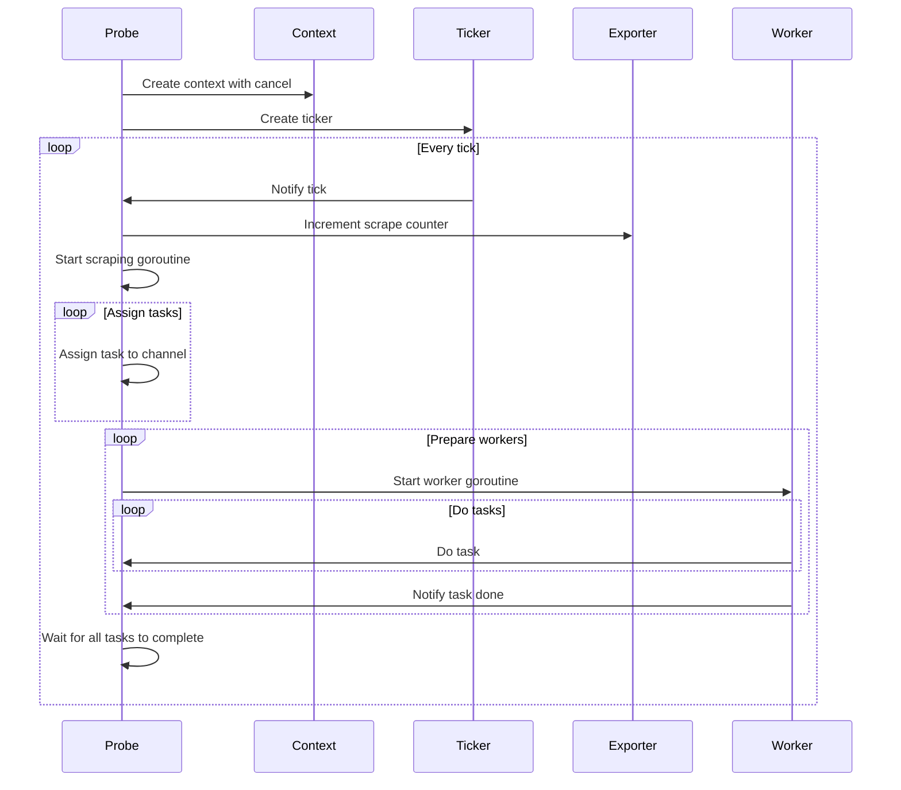

```mermaid

sequenceDiagram
    participant a as Probe
    participant c as Context
    participant t as Ticker
    participant e as Exporter
    participant w as Worker
    a->>c: Create context with cancel
    a->>t: Create ticker
    loop Every tick
        t->>a: Notify tick
        a->>e: Increment scrape counter
        a->>a: Start scraping goroutine
        loop Assign tasks
            a->>a: Assign task to channel
        end
        loop Prepare workers
            a->>w: Start worker goroutine
            loop Do tasks
                w->>a: Do task
            end
            w->>a: Notify task done
        end
        a->>a: Wait for all tasks to complete
    end
```
